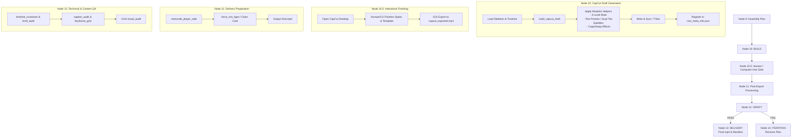

# CapCut Pipeline Integration Design Spec

This document details how the CapCut draft mutation helpers and post-export finalization from the reference kit are integrated into the Node 0-14 video pipeline.

---

## Node-by-Node Integration & Data Flow

### Node 10 (BUILD) — Draft Generation & Style Mutation
* **Role**: Turn the structured `timeline_build.json` (from Node 9 editor) into a fully styled and synced CapCut draft folder.
* **Input**:
  - `timeline_build.json` (clips, source paths, cut timestamps, text overlays).
  - Sanitized skeleton template folder (`video_pipeline_core/templates/0608`).
* **Processing**:
  1. **Folder Sync & ID Mapping**: Clone the skeleton structure and update internal timeline IDs in `timeline_layout.json` and `Timelines/project.json`.
  2. **Segment Audio Muting (`mute.py` logic)**: Mutate the video segments in the draft to set their volume to 0 (mute), preserving audio space for the pipeline's BGM and Edge-TTS narrations.
  3. **Text Preset & Bilingual Styles (`text_style.py` logic)**: Update the text materials to apply selected font sizes, styling presets, or generate dual-tier bilingual captions (narrative + translation).
  4. **Sticker/Effects Binding (`effects.py` logic)**: Link specific segment clips to transition or animation overlays.
  5. **Sync & Registration**: Write the 7 synced JSON files and register the project in CapCut's `root_meta_info.json`.
* **Output**:
  - `capcut_draft_manifest.json` (marked with `"requires_human_or_computer_use": true`).
  - Active draft directory under CapCut's user projects folder (`com.lveditor.draft/run_name`).

---

### Node 10.5 (Human / Computer-Use Gate) — Interactive Finish
* **Role**: Interactive manual polishing and video export.
* **Processing**:
  1. The user (or a Computer-Use GUI agent) opens CapCut.
  2. Refines templates, filters, or text animations.
  3. Exports the raw timeline from CapCut to a file named `capcut_exported.mp4` under the run directory.
* **Output**:
  - `capcut_exported.mp4` (temporary raw export).

---

### Node 11 (Post-Export Processing) — Delivery Formatting
* **Role**: Format and package the GUI-exported MP4 into a standardized, player-safe production delivery.
* **Input**:
  - `capcut_exported.mp4`
* **Processing**:
  1. **Voice-End Trimming (`post_export.py` / `detect_voice_end` logic)**: Run `silencedetect` via ffmpeg to trim trailing silent frames and ensure clean BGM ducking.
  2. **Format Re-encoding (`reencode_player_safe` logic)**: Re-encode the video using standard `libx264` settings (`-bf 0`, CFR, closed-GOP) to guarantee it plays correctly on all players and web dashboards.
  3. **Outro Card Injection (`add_outro_card` logic)**: Append outro titles or branding slides at the end of the video.
* **Output**:
  - `final.mp4` (the canonical unattended delivery output).

---

### Node 12 (VERIFY) — Technical QA Audit
* **Role**: Automatically run technical and visual verification tools on `final.mp4` to score the CapCut finishing results.
* **Input**:
  - `final.mp4`
  - `subtitles.srt` / `timeline_build.json`
* **Processing**:
  - Run the P1 verification tools: `timeline_invariants`, `broll_audit`, `caption_audit`, `keyframe_grid`, and `visual_audit`.
* **Output**:
  - `verify_result.json` (technical score).
  - `state.json` (updated with `accepted=true` if score >= 80.0, else routes to Node 14 for revision).
