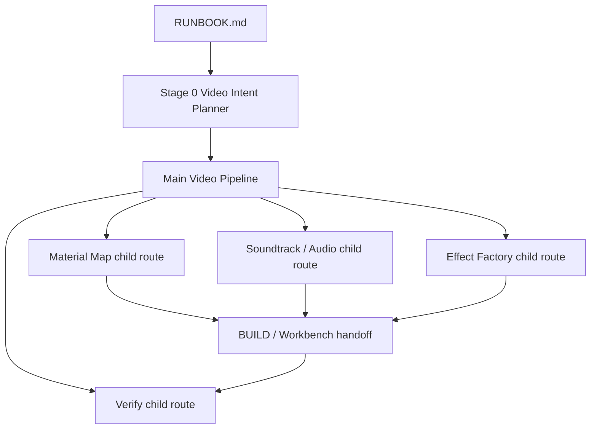

# Repo Consolidation Non-UI Construction Plan

This plan records the current non-UI consolidation direction for Hermes Video
Pipeline. It is an operational construction guide, not a historical note.

## Goal

Make the repo usable as one guided video-production map:

- one main Video Pipeline route;
- bounded child routes for Material Map, Effect Factory, Soundtrack/Audio, and
  Verify;
- clear artifact ownership in each run folder;
- no UI rewrite in this phase.

The working rule is: route and artifact boundaries first, UI later.

## Current Scope

Do now:

- keep `RUNBOOK.md` as the single entry document;
- keep `docs/pipeline-decision-tree.md` as the route decision tree;
- keep `docs/video-pipeline-operating-map.md` as the stage/tool/artifact map;
- keep child-route guides under `docs/construction-guides/`;
- make Effect Factory generic capabilities available through manifest,
  validator, capability review, worker bridge, and skill docs;
- classify run artifacts by decision value so auto-generated noise does not
  become the human review surface.

Do not do now:

- build or redesign dashboard/workbench UI;
- promote one-off effect probes into fixed templates unless the user explicitly
  asks for dictionary/template promotion;
- move Remotion to canonical final render;
- collapse child routes into the main route.

## Route Shape



Child routes may be invoked from Stage 0 or from later gates. They write
reviewable artifacts and return to the main route; they do not replace the main
route.

## Stage 0 Contract Expansion

Stage 0 should write the first version of these contracts when the user request
mentions them or when the route needs them:

- `video_intent.json`: purpose, audience, input state, entry path, follow-up
  questions, assumptions.
- Material decision fields: whether to scan all material, scan selected folders,
  or ask for a narrower source.
- `soundtrack_contract`: music/voice/source-audio intent, whether lyrics are
  allowed, whether original speech should be preserved, and whether downloaded
  music is acceptable.
- `subtitle_voiceover_contract`: voiceover/subtitle need, provider preference,
  and fallback policy.
- `effect_policy`: required/optional effects, effect role, duration, source
  refs, and whether Effect Factory is allowed to probe.

If information is missing, ask at most the minimum high-value questions. If the
answer is still vague, keep the assumption visible in the contract and route to
the smallest safe boundary test.

## Child Route Boundaries

### Material Map

Purpose: agent eyes for source footage and generated/source material truth.

Primary artifacts:

- `project_material_map.json`
- per-asset maps under `maps/`
- `material_delta.json`
- material review/apply artifacts
- optional material matrix / montage-wall evidence

The route may suggest rough-cut anchors, gaps, duplicates, and usable ranges. It
must not silently approve a timeline clip that does not match material-map IDs
or need refs.

### Soundtrack / Audio

Purpose: agent ears for music, lyrics, source audio, voiceover, ducking, and
license/source constraints.

Primary artifacts:

- `soundtrack_plan.json`
- `sound_license_manifest.json`
- `soundtrack_probe_report.json` or probe bundle
- `audio_director_handoff.json`
- `music_manifest.json` / `audio_mix_plan.json` / `audio_mix_report.json` when
  build executes mixing
- `narration_manifest.json` when voiceover is required

The route should distinguish original speech preservation from music-bed
replacement. Human-voice music can conflict with narration and should be
flagged before BUILD.

### Effect Factory

Purpose: translate fuzzy visual effect language into reviewed Remotion worker
parameters without making one-off templates.

Primary artifacts:

- `visual_technique_plan.json`
- `visual_technique_plan.confirmed.json`
- `effect_capability_review.json`
- `remotion_prompt_pack.json`
- `remotion_worker_outputs.json`
- `remotion_effect_review.json`
- `effect_handoff.json` / `remotion_effect_handoff.json`

Generic capability vocabulary is owned by
`video_pipeline_core/effect_layer_manifest.py`. Supported generic layer graphs
go through `GenericRemotionEffect`; named templates are promoted only after
accepted review evidence and explicit user intent.

Current generic primitives include `image_layout` modes such as `center_logo`
and `full_bleed_hero`, plus `radial_current` for outer-ring current / orbit /
energy-flow accents. These are generic primitives, not fixed brand templates.

### Verify

Purpose: final and intermediate eyes/ears/brain checks.

Primary artifacts:

- `verify_result.json`
- `delivery_gate.json`
- montage/contact-sheet evidence
- audio probe/ducking evidence
- subtitle/caption/layout audits
- material timeline semantic checks

`verify_result.pass=true` is not enough by itself when delivery gate or route
audits fail. The dashboard and reviewer reports should surface the gate result.

## Run Folder Artifact Policy

Treat the run folder as the handoff unit, but separate artifact classes:

| Class | Human meaning | Examples |
| --- | --- | --- |
| `decision` | changes route/build decisions | `video_intent.json`, `material_delta.json`, `effect_capability_review.json`, `delivery_gate.json` |
| `contract` | main or child route contract | `segment_contract.json`, `soundtrack_plan.json`, `effect_build_spec` inside prompt params |
| `handoff` | child route returns to main route | `audio_director_handoff.json`, `effect_handoff.json`, `workbench_handoff.json` |
| `evidence` | reviewable proof | contact sheets, montage walls, probe reports, visual/audio audits |
| `asset` | generated/downloaded media | preview mp4, downloaded music, generated images, proxies |
| `debug` | machine trace, logs, scratch | temp frames, intermediate render projects, raw probe dumps |

Only `decision`, `contract`, `handoff`, and selected `evidence` artifacts should
be front-and-center for a human. `asset` and `debug` artifacts may be large and
should be referenced by manifest instead of listed as primary review content.

Generate the machine-readable index without moving or deleting files:

```powershell
python tools\run_artifact_index.py --run RUN_DIR --json
```

This writes `run_artifact_index.json`. UI, reviewers, and agents should prefer
`review_priority=["decision","contract","handoff","evidence"]` before showing
large `asset` or `debug` entries.

## Immediate Non-UI Work Items

1. Register any worker-proven generic Effect Factory primitive in
   `effect_layer_manifest.py`.
2. Add validator/capability tests for the primitive.
3. Update Effect Factory route docs and skills with the primitive and its
   non-template policy.
4. Keep `RUNBOOK.md` and the decision tree pointing to child-route boundaries.
5. Use `tools/run_artifact_index.py` to classify noisy run outputs before
   surfacing them to a human or dashboard.
6. When a new run artifact type is introduced, decide whether it is `decision`,
   `contract`, `handoff`, `evidence`, `asset`, or `debug` before surfacing it.

## Done Criteria

- Focused tests pass for Effect Factory manifest/validator/capability/worker
  bridge.
- The construction guide names the main route and child-route boundaries.
- The guide states which artifacts matter to humans and which should stay as
  manifest-referenced noise.
- UI files are unchanged except for future explicit UI work.
