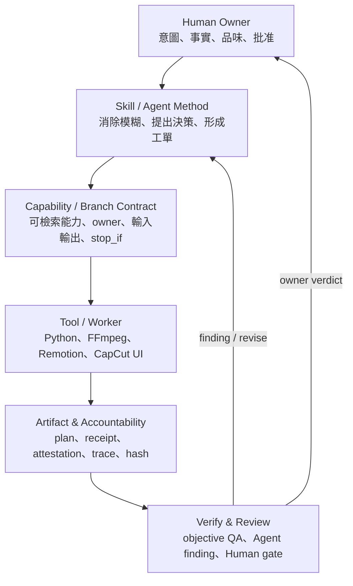

# Hermes V Pipeline 誠實架構與能力報告

Date: 2026-07-15  
Status: observational snapshot / AI discussion handoff  
Operational authority: [`RUNBOOK.md`](../RUNBOOK.md) →
[`HANDOFF_CURRENT.md`](../HANDOFF_CURRENT.md) → current run artifacts  
This document describes the system. It does **not** advance a Stage, unlock
BUILD, approve creative quality, or authorize delivery.

## 1. 給另一個 AI 的一句話結論

Hermes 是一座已能產生、稽核、回修影片的 **Agentic 剪輯工廠**，不是一個
單一剪片演算法，也還不是能一鍵穩定做出驚艷長片的全自動剪輯師。

它現在最強的是：

- 把 Human、Agent、Skill、Capability、Tool、Artifact、Verify 串成可追溯閉環；
- 素材地圖、字幕精確綁定、音訊預覽、效果 worker、候選片與 QA 都有真實產物；
- 新工具有 owner、可檢索能力卡、receipt/trace/hash 與孤兒預防；
- 已把 CapCut 接成可選的高品質外接 finishing 廠商，而不是第二套主工廠。

它現在最弱的是：

- 素材語意理解、長片故事編排、跨段節奏與多曲聲音設計仍不夠成熟；
- 技術驗證很會證明「沒有壞」，不能單獨證明「很好看」；
- 54 張正式 Capability 中只有 4 張是 bounded，沒有 registry-level certified；
- 540 秒全片目前仍在 Stage 5 紙剪／storyboard／效果預覽，尚未完成全片 render。

| 觀看角度 | 2026-07-15 誠實評價 |
|---|---:|
| Agentic 影片研發與治理平台 | **8.2 / 10** |
| Human + 強 Agent 的剪輯副駕 | **7.0 / 10** |
| 可重用的有人把關生產線 | **6.5 / 10** |
| 一鍵產出好看長片的 AI 剪輯器 | **4.5 / 10** |

分數不同是因為 Hermes 的治理、證據與接線成熟度，明顯高於自動品味成熟度。

## 2. 本報告的證據基礎

這不是從 README 宣傳文字推論，而是交叉讀取與實跑：

- codebase-memory MCP：15,614 nodes、48,781 edges；
- `RUNBOOK.md`、current handoff、branch registry、Skill Index；
- Skill Tool Contract 與 Capability catalog 的 fresh audit；
- Canon 67 39 秒 L0–L5 四層整合候選；
- Canon 67 150 秒 picture-first 候選及 owner 否決意見；
- Canon 67 540 秒 Stage 0–5 story/material/retrieval/storyboard 產物；
- Canon 67 結尾 MemoryPhotoWall v3 與 40 秒 CapCut GUI forward test；
- focused tests、full-suite 歷史證據、media QA、perception wall 與檔案 hash。

另有一項會改變解讀方式的 owner 上游事實：Canon67 的 81 個素材不是完整 raw
shoot，而是他人先挑選過、沒有拍攝意圖備註的二手素材。這代表部分 coverage、
B-roll、alternate take 與語意缺口在 Hermes 收到素材前就已形成。能力成熟度若
不攜帶素材出處，會把輸入天花板誤算成系統天花板。

### 2.1 三個上游因果

1. **素材出處決定語意上限**：speech 自帶語意 anchor；無備註圖像必須靠名稱、
   wall、ASR 與 Agent 推斷。
2. **驗證成本分布決定迭代密度**：可自動驗證的底層能跑大量回合；需要 Human
   品味的上層直到 paper-edit A/B 才得到便宜而真實的比較訊號。
3. **品味結晶度決定 build/buy**：故事、素材真相、picture lock 與核准文字承載
   owner 意圖；成熟效果與音樂則是市場已累積的品味，應優先整合而非重造。

狀態詞彙：

| 狀態 | 意義 |
|---|---|
| **PASS** | 有可重跑命令、exit code、hash、receipt 或可見產物。 |
| **BOUNDED** | 只在明確片型、素材、版本或片長證明，不可外推。 |
| **EXPERIMENTAL** | 介面與測試存在，跨片型穩定性未證明。 |
| **FAIL** | 有客觀或 owner 證據顯示未達需求。 |
| **UNKNOWN** | 證據不足；不是 FAIL，也不能宣稱成功。 |

## 3. Hermes 的本體：三個角色、四個層、兩種執行場

### 3.1 三個角色

| 角色 | 真正負責的事 | 禁止偷渡的事 |
|---|---|---|
| Human Owner | 目的、事實文字、品味、picture lock、rights 與交付裁決 | 替機器追每個工具、把沉默當核准 |
| Agent Director / Orchestrator | 消除模糊、讀素材與證據、提出剪輯決策、選 Capability、帶 context 到下一段 | 自己翻 creative/delivery flag、繞 gate、私造平行工廠 |
| Deterministic Worker | 掃描、轉碼、選窗、組片、混音、字幕、效果、hash、QA、receipt | 猜品味、改事實、把 technical PASS 當成好看 |

一個強 Agent 加一個 Human 就能運作。Orchestrator 不一定是另一個模型；它是
Agent 在當前 Stage 使用的協調角色與薄控制規則。

### 3.2 四個工程層



Skill 是工作方法與判斷規則；Capability 是可查表的公開操作契約；Tool 是實際
機具。三者不應互相重做。

### 3.3 兩種執行場

1. **Hermes 本地工廠**：Python、FFmpeg、Remotion、Material Map、字幕、音訊、
   Verify，適合可重現、無人值守與嚴格證據。
2. **外接 finishing 廠商**：目前是 CapCut Desktop，適合成熟的現成效果、GUI
   品味微調、混音與輸出；仍必須回 Hermes Verify。

外接廠商不擁有 story、material truth、picture truth、approved text 或 delivery。

## 4. 唯一入口與整條實際資料流

正式操作入口只有 `RUNBOOK.md`。概念上的完整流是：

```text
User request
  → Stage 0 模糊消除 / video intent
  → Stage 1-2 story soul / screenplay / director contract
  → Stage 3 Material Map / evidence / usable windows
  → Stage 4 material delta / coverage gate
  → Stage 5 L1 picture + L2 effects + L3 audio + L4 text decisions
  → Stage 6 registered renderer 或 CapCut-assisted candidate backend
  → Stage 7 technical Verify
  → Stage 8 Agent + Human review
  → Stage 9 bounded repair / finishing / loop return
  → Stage 10 owner delivery decision
```

資料設計不是每段重新摘要，而是：

```text
上游完整證據
  → 去蕪存菁成下一層契約
  → 保留來源 hash、決策理由、未知項與 owner gate
  → 下游增量補充
```

目標是 `compact to next level`，不是移除關鍵資訊，也不是把完整聊天記錄塞進每個
worker prompt。

### 4.1 Stage 與 Editing Loop 的權限差異

**Stage 決定生命週期；Loop 決定當下怎麼剪得更好。**

| Stage hook | Loop 方法 | 產物 |
|---|---|---|
| S0–S2 | 固定目的、片型、故事主軸、coverage 與契約 | intent、blueprint、segment contract |
| S3–S4 | L0 素材沉浸、truth/evidence、selects | Material Map、delta、selects |
| S5 | L1 picture、L2 effect、L3 audio、L4 text | layered edit decision plan |
| S6 | 註冊 renderer 執行；Loop 不能自封 canonical | candidate render |
| S7–S8 | L5 objective/agent/human review | QA、finding、verdict |
| S9 | finding 回派到有關的 L0–L4 | bounded revision |
| S10 | owner + delivery gate | delivery 或拒絕 |

Loop Skill 是增量方法，不是第二條 pipeline。Worker 可以執行 Tool，但不應自行
重寫 Loop 方法或 Stage cursor。

## 5. 八個正式部門與一個外接廠商

| 部門 / provider | 責任 | 誠實邊界 |
|---|---|---|
| Main Pipeline | Stage 0、cursor、BUILD eligibility、branch return、delivery promotion | 擅長管制與 handoff，不代表自動生成好 timeline |
| Film Canon Product Route | 片型 blueprint、coverage、product readiness | 結訓片骨架已有，尚未一鍵完整成片 |
| Material Map | inventory、素材理解、usable windows、selects、delta、rough cut | 最深的部門；語意仍受命名、標籤、ASR 與取樣品質限制 |
| Soundtrack Arranger | 音樂候選、probe、license evidence、handoff | 曲庫、rights、多曲編排仍薄 |
| Subtitle / Voiceover | ASR、人工核准、exact subtitle、voice handoff | 39 秒 12 cues 實證；跨片型未 certified |
| Effect Factory | 模糊效果→concept/params→worker→review→handoff | Remotion/模板深度有限；不擁有 final.mp4 |
| Workbench / Brownfield | draft patch、preview、局部修訂 | 安全草稿台，不是完整 NLE，不直接改 canonical truth |
| Verify / Delivery | media QA、字幕/音訊/黑幀/perception、delivery gate | 能證明沒壞，不能單獨證明好看 |
| CapCut Assisted Finishing | free/native effect、local music、GUI preview、export | 外接、互動、版本相依；不擁有故事、選片、文字、rights 或 delivery |

Fresh registry audit：8 branches、17 registered stages、0 findings。CapCut 是
provider/backend Skill，不新增第九個 branch orchestrator。

## 6. L0–L5 的真實成熟度

| LOOP | 人話 | 已證明的 scoped 能力 | 主要缺口 |
|---|---|---|---|
| L0 | 真正看素材、形成 selects | clean-blind selection、Material Map、retrieval report | 長片素材沉浸的一致性、人物/事件 truth |
| L1 | 決定畫面順序與 source windows | 44 秒局部替換、39 秒 rough cut、540 秒 retrieval-backed paper plan | 故事性、跨段重複、視覺焦點與長片節奏 |
| L2 | 標題、轉場、效果 | title lifecycle、MemoryPhotoWall v3、CapCut free effect pilot | 一般效果品味與可重用模板深度 |
| L3 | speech/music/ducking/SFX | 39 秒 speech-aware preview、CapCut local music export | 多曲編排、正式 rights、長片語音 ducking |
| L4 | approved text→實際字幕 | 39 秒 12-cue exact binding、strict negative tests | 長片字幕、CapCut 字幕 round trip |
| L5 | 看完整候選、產 finding、回派 | 39/44/150 秒 technical review、CapCut Stage 7 return | 自動品味、跨 review consistency |

注意兩種成熟度不能混用：

- **Skill reproducibility**：Agent 能不能按方法做出相同形狀的閉環；
- **Capability maturity**：公開 Tool/contract 能不能跨素材、片型與版本穩定工作。

Canon67 的 L0/L1 evidence 應標記為 `material_origin=curated`、
`annotation_state=unannotated`。未來 transfer test 不只要換一批不同素材，還應
加入 `raw + intent_annotated` 素材，才能分辨輸入上限與系統上限。

## 7. 工廠規模、機械化與 Agent 檢索

### 7.1 Repo 規模

| 指標 | Fresh 值 |
|---|---:|
| Tracked files | 1,214 |
| Markdown files | 385 |
| Python files | 645 |
| Top-level Skill files | 30 |
| Skill Tool Contracts | 12 |
| `tools/*.py` | 109 |
| Core Python modules | 182 |
| Test modules | 264 |

這是中大型個人研發 repo，不是小工具；但 owner 邊界與入口仍可辨識，尚未成為
不可理解的巨獸。

### 7.2 Capability 與孤兒預防

Fresh audit：

| 檢查 | 結果 |
|---|---:|
| Canonical Capability cards | 54 |
| Experimental | 50 |
| Bounded | 4 |
| Registry-level certified | 0 |
| Python tools owned | 109 / 109 |
| Orphan Python tools | 0 |
| Duplicate Capability IDs | 0 |
| Broken tool/command/domain/director refs | 0 |

四張 bounded cards：

- `cap.material-map.material-rough-cut.v1`
- `cap.material-map.picture-plan-retrieval-report.v1`
- `cap.audio-director.audio-mix-plan-execute.v1`
- `cap.capcut-assisted-finishing.draft.v1`

所以新正式工具不容易成為孤兒；`.tmp` helper、reference repo 與歷史 script 若未
註冊，本來就不屬於正式 Capability。

### 7.3 Agent 如何找到工具

```text
RUNBOOK semantic router
  → active Stage / owner
  → Skill Tool Contract
  → dispatch-capabilities by query / loop / capability ID
  → canonical tool
  → receipt / attestation / trace
```

`editing-loop-director` 是 Capability consumer，不是工具 owner。它可以查到 audio、
material、effect、subtitle、verify、brownfield 與 CapCut，不能私建第二份工具目錄。

## 8. 真實案例證據

### 8.1 Canon 67 39 秒：目前最完整的 L0–L5 證據

同一候選中已接起：

- 訪談原始 speech continuity；
- training/life cutaways；
- lower-third；
- BGM + speech-aware ducking；
- owner-approved 12-cue exact subtitles；
- rendered QA、final Verify、perception；
- full-suite regression。

技術整合 PASS，但音樂為 preview-only，delivery gate 正確拒絕，所以不是交付片。

### 8.2 Canon 67 150 秒：技術 PASS、創意 FAIL

技術證據：42 clips、150.034 秒、7-page wall、151 samples、0 gaps、QA/Verify
PASS、full suite 2,786 tests PASS。

但 owner review 明確指出：

- 沒有可感知的故事主軸；
- 相鄰不重複，但跳張仍重複；
- 素材類別亂散，同類事件沒有形成有意義單元；
- 部分照片本身沒有敘事作用；
- Ken Burns 常朝天空或背景移動，沒有跟人物/動作焦點；
- 草圖缺少 review captions，難以判斷段落意圖。

這支片是重要反例：**QA 全綠仍能剪得比舊 orchestrator 差。**它證明 Stage 0–2
故事主軸、素材沉浸與 L1 picture judgment 必須先成立，不能用更多 gate 代替。

### 8.3 Canon 67 540 秒：故事與紙剪已成立，全片 render 尚未成立

現有 scoped 產物包含：

- 540 秒、三幕、十段成果報告方向；
- A/B paper edit 的整合裁決；
- 81 個 source-hash-bound assets 的 Material Map；
- filename/folder prior → wall review → ranking report → Top-K selection；
- 53 clips 的 retrieval-backed picture plan；
- teacher/adviser all-or-none 規則；目前 proposed selection 為 0；
- 40 秒 MemoryPhotoWall v3 結尾；
- renderable capacity 540.003 秒、video over-allocation 0、duplicate source windows 0。

接受的靈魂整合：

> A 是成果報告與事實 coverage 的骨架；B 是情緒連續與敘事黏著劑。  
> 核心 motif：`從學會，到接棒。`

目前仍是 Stage 5 proposal/review 狀態，沒有 540 秒完整 candidate，因此長片品質、
跨段節奏、音樂、字幕與整體 landing 都是 UNKNOWN。

這個故事野心必須被素材真相封頂。想講但素材不支撐的方向，應記為
`deferred_due_to_material`，並區分 `not_found`、`not_present`、
`present_unusable`、`excluded_by_policy`；已明確放棄的 A/B 故事方向則進
`retired_story_intents`，避免後續 Loop 無意識撿回。

### 8.4 CapCut 40 秒 finishing：外接廠商接力已證明

實際 GUI forward test：

- CapCut Desktop 8.9.1.3802；
- 40 秒、1920×1080、30 fps 的 MemoryPhotoWall source；
- 免費原生 `膠片框 / 影片框` 效果，0–32 秒；
- local instrumental，-16.5 dB、2 秒 fade-out；
- native `Warm Piano` 到 export preflight 才顯示 Pro，已移除；
- 成功 local export，H.264 + AAC，40.009 秒；
- rendered product QA、final-product Verify、perception coverage 全 PASS；
- export SHA-256：
  `E5E3265BE289036C28E89166CF5F520647C3E192A0E3B404FC405F0C0652C0AE`。

實測同時修復兩個 production defects：

1. thin `type=audio` draft record 會被 CapCut 8.x 無聲忽略，已改成完整
   `extract_music` desktop shape；
2. local video 若繼承 skeleton 的 remote catalogue identity，CapCut 會把路徑改回
   online cache；現在會清除 remote identity 並明確綁 local source。

這證明 CapCut 能節省效果與 finishing 開發，但只證明 **bounded provider route**，
沒有證明 unattended 540 秒、自動字幕、長片 ducking、多效果或正式 music rights。

## 9. CapCut、Remotion、FFmpeg 與 reference repo 的定位

| 路徑 | 最適合 | 上限 / 代價 |
|---|---|---|
| FFmpeg/local renderer | 可重現組片、字幕、混音、無人值守、fallback | 現成視覺模板與品味微調較弱 |
| Remotion Effect Worker | 有界 title、lower-third、photo wall、客製動畫 | 每個高品質效果仍需設計與調參 |
| CapCut Assisted Finishing | 成熟原生效果、互動式調整、免費或已授權素材、輸出 | GUI/版本/地區/Pro gate 相依，需 Human/Computer Use |
| OpenMontage 等 reference repo | 隔離研究、Hero Cut 對照 | 未正式吸收前不算 Hermes 能力 |
| Video Autopilot Kit | CapCut draft/GUI/QA 參考 | 核心操作、catalogue/export/paywall 部分閉源或缺失 |

Video Autopilot Kit 的 100+ 坑不會整包進常駐 Skill。規則是：

- 在 Hermes 真實重現 → 固化進 Tool、Skill stop condition 或 regression test；
- 尚未重現但可能有用 → archive/reference only；
- 已被正式能力取代 → 不再進 RUNBOOK 或主 prompt。

Build/buy 的前置判準是能力承載什麼價值：

- `intent_bearing`：自建、自有、留在 canonical truth；
- `taste_crystallized`：優先購買或整合成熟工具/授權資產；
- `hybrid`：Hermes 保留意圖與證據，外部 provider 執行 finishing。

這裡不使用 `provenance_class` 命名，避免與素材出處及 candidate backend lineage
混淆。Remotion Effect Factory 應聚焦 CapCut 沒有、而且本片特有的效果，不追平
通用商業特效庫。

## 10. Verify 的能力上限

Verify 可以可靠量：

- decode、duration、resolution、fps、stream、黑幀；
- source hash、source window、重複素材；
- exact subtitle text/timing；
- speech continuity、音量、clipping、基本 soundtrack probe；
- effect 是否存在、何時存在；
- perception 取樣是否覆蓋全片。

Verify 不能可靠決定：

- 情緒是否堆疊成功；
- 哪顆鏡頭應多停 0.7 秒；
- 相似但不相同的事件是否仍產生重複感；
- Ken Burns 是否真的跟隨人物與動作；
- 音樂高潮是否有意義；
- 結尾是否令人記住人，而不是只記得效果。

因此 Human taste gate 是現在的必要產品邊界。Workbench 可以讓 Human 調契約，
但不能把主觀品味假裝成客觀 PASS。

## 11. 工程健康與技術債

### 11.1 健康部分

- single operator entry 有 executable boundary tests；
- 8 branch / 17 stage registry fresh audit 0 findings；
- 109/109 Python tools 有 owner，orphan=0；
- Capability ID、command、domain、director reference audit 全綠；
- receipt、attestation、trace、immutable hash 已在真實 run 使用；
- 39 秒、150 秒與 CapCut candidate 都有實體影片與 Verify 證據；
- full suite 採 final regression gate，不在每個小 loop 重跑。

### 11.2 可控但真實的債

| 債務 | 風險 | 建議 |
|---|---|---|
| `HANDOFF_CURRENT.md` 仍停在較早 Stage 4，實際 run 已有 L1 v3 / CapCut pilot | 新 AI 可能讀到舊 cursor | machine-readable current run 優先；下一個正式續跑前刷新 handoff |
| `docs/capcut-pipeline-integration-design.md` 使用舊 Node 10.5/12 語言 | 與現在 Stage 6/9→Stage 7 說法衝突 | 以 `skills/capcut-assisted-finishing.md` 為現行權威，舊文降為 reference |
| `video_tools.py` CLI 面積很大 | Agent 迷路、重複造輪子 | 維持 RUNBOOK + dispatch-capabilities，不新增第二入口 |
| Dashboard handler 熱點 | UI/API 變更回歸面集中 | 有真實缺陷或 UI 改動才拆，不為整潔重構 |
| `.tmp` campaign status 有歷史狀態並存 | 續跑時誤把舊 Stop-Loss 當最新 | 每個 campaign 指定一個 canonical status，舊狀態標 historical |
| 50/54 Capability 仍 experimental | 跨片型過度宣稱 | 用第二批素材 transfer test 才升 maturity |
| Material Map truth 仍依賴 metadata / sampling | 故事與分類錯誤可一路下游放大 | 名稱只當 prior；wall/ASR/agent review 必須 confirm/correct |
| CapCut GUI 與免費資產不穩定 | 改版或 Pro gate 讓流程失效 | exact version + export preflight + local renderer fallback |

這些債不阻止繼續剪長片。最危險的不是 code size，而是**把技術綠燈誤當創意
成功，以及讓舊 handoff/歷史文件誤導新 Agent。**

## 12. 目前真正的閉環程度

| 閉環 | 程度 |
|---|---|
| 工具註冊與孤兒預防 | 高 |
| 單一入口、派工與 owner | 中高 |
| 工具有沒有真的執行 | 高 |
| 失敗是否留下證據並 fail-closed | 高 |
| finding → bounded repair → re-Verify | 中高 |
| 39 秒全層候選 | 中高（rights/taste 未交付） |
| 150 秒 picture assembly | 技術高、創意低 |
| 540 秒 Stage 0–5 紙剪 | 中；尚未全片 render |
| CapCut 高品質 finishing 接力 | BOUNDED PASS |
| 跨片型 transfer | 中低 |
| 自動品味 | 低到中 |
| 無人值守高品質長片 | 低 |
| 最終 delivery automation | 中；Human/rights/taste 必須保留 |

## 13. 建議下一步

優先序不是再造 orchestrator，而是：

1. 修正 current machine state、`full_suite=STALE` 與 owner deferred reasons；
2. 建 `global_editorial_state.v0` 的不可變 hash/delta 最小 schema；
3. 用 540 秒前兩段真實資料校準一次後凍結 v1；
4. 把其餘段落的 factual purpose、story contribution、素材家族、source windows、
   review captions 與 material-deferred intent 鎖清楚；
5. 高影響且模糊的 Stage 2/5 紙剪決策預設
   `decision_mode=ab_comparison`，低影響或事實性決策可 `single`；
6. render 章節級候選，不讓 CapCut 承擔未解的故事與 picture 模糊；
7. speech 段完成 L3 ducking 與 L4 approved subtitles；
8. 將 review finding 分為 objective / structural_candidate / taste，只回派受影響段；
9. picture/text 鎖定後，再由 CapCut 做 Stage 6/9 finishing 並攜帶 backend provenance；
10. export 回 Stage 7 Verify，Human 判定故事、重複感、音樂與效果；
11. 用不同素材且更好出處的 transfer evidence，才升 Capability maturity。

CapCut 最適合節省「現成效果與最後一哩品味微調」，不適合補救未完成的素材理解
或沒有故事主軸的 picture plan。

## 14. 可供另一個 AI 討論的核心問題

1. 540 秒成果報告應先做到多深的章節鎖定，才交給 CapCut？
2. CapCut 應只做 Stage 9 finishing，還是也作 Stage 6 preferred candidate backend？
3. Material Map 如何在不增加巨量 token 下，提高「事件家族、人物、動作、故事功能」
   的理解一致性？
4. 如何驗證非相鄰重複與 semantic repetition，而不只驗 source hash 重複？
5. 哪些品味判斷應保留 Human，哪些可由強 Agent 形成可重用 heuristic？
6. 章節級 CapCut handoff 是否比整片單一 draft 更可恢復、更便宜？
7. 何種 transfer evidence 足以把 experimental Capability 升為 bounded/certified？
8. 哪些重大故事決策值得 A/B，如何避免雙做變成新的流程稅？
9. 能否取得 raw + intent-annotated 素材，與 curated-unannotated 做分層比較？

## 15. 給下一個 AI 的 Read Order 與禁區

### Read order

1. `AGENTS.md`
2. `RUNBOOK.md`
3. 本報告
4. `skills/editing-loop-director.md`
5. `skills/capcut-assisted-finishing.md`
6. `docs/decisions/2026-07-15-canon67-outcome-report-soul-integration.md`
7. `docs/decisions/2026-07-15-capcut-assisted-finishing-forward-test.md`
8. `docs/decisions/2026-07-15-upstream-editorial-discovery-boundary.md`
9. `.tmp/canon67_540s_route_acceptance/` 內最新 scoped evidence

### Do not do

- 不要建立第二入口、第二 registry 或第二 orchestrator；
- 不要讓 Loop Skill 推進 Stage cursor；
- 不要讓 CapCut 改寫 story/material/picture/text truth；
- 不要把 reference repo 當已整合能力；
- 不要從 technical PASS 推論 creative PASS；
- 不要把 preview-only / unresolved license 音樂當可交付；
- 不要因為已有 540 秒 duration plan 就宣稱全片完成；
- 不要為了讀完整歷史而掃光所有 `.tmp`；從本報告列出的 anchors 開始。

## 16. 可重跑的證據命令

```powershell
C:\Users\user\miniconda3\python.exe video_tools.py registry-audit --json
C:\Users\user\miniconda3\python.exe tools\skill_tool_contract_audit.py --skills-dir skills --tools-dir tools --json
C:\Users\user\miniconda3\python.exe video_tools.py dispatch-capabilities --query capcut --json
C:\Users\user\miniconda3\python.exe -m unittest tests.test_skill_index tests.test_skill_tool_contracts tests.test_pipeline_skill_boundaries tests.test_capcut_backend -v
```

Fresh scoped evidence at report time：48 tests PASS；Skill/Tool audit PASS；8 branches、
17 stages、54 cards、109/109 owned tools。最新完整 full-suite 證據仍來自 CapCut
接線前的 150 秒 closure：2,786 tests、1 skipped、exit 0；CapCut backend patch 後尚未
重跑 full suite，因此不能把該 full-suite PASS 外推到本次所有 dirty-tree 變更。

## 17. 最終誠實定位

Hermes 已經不是空架構。它有真實素材理解、timeline、字幕、音訊、效果、候選片、
Workbench、Verify、Capability registry、Accountability，以及已 forward-tested 的
CapCut finishing 接力。

它也還不是 CapCut/Premiere 的替代品，更不是自動導演。現在最準確的產品定位是：

> Hermes 是一座會守規矩、會留下證據、能驅動本地與外接工具的 Agentic 影片工廠；
> 強 Agent 與 Human 共同擔任剪輯師，而工廠正在把成功的剪輯經驗逐步固化成能力。
